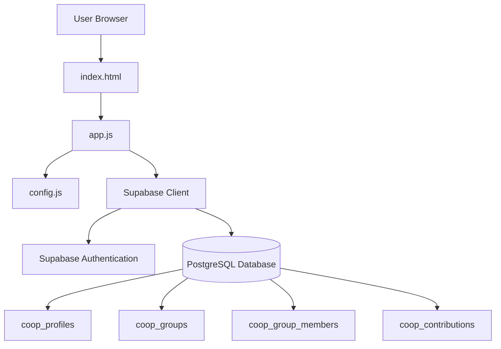
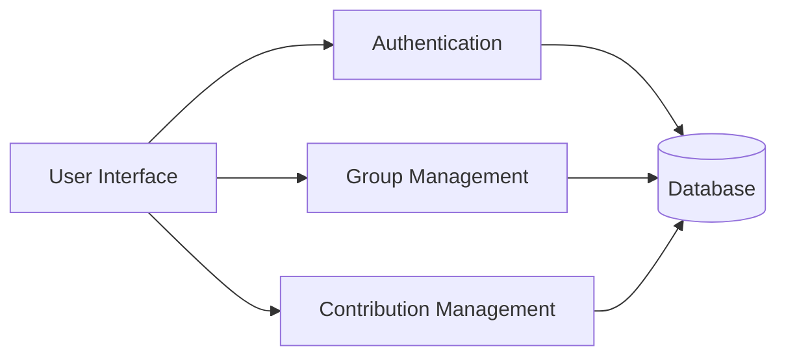
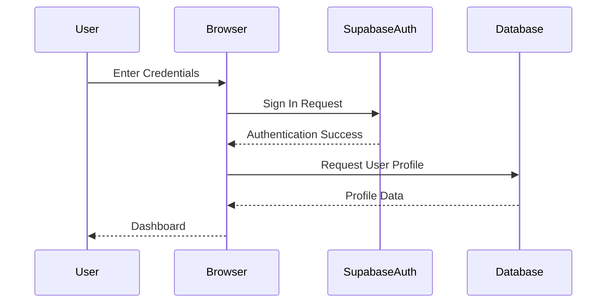
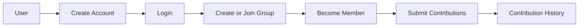
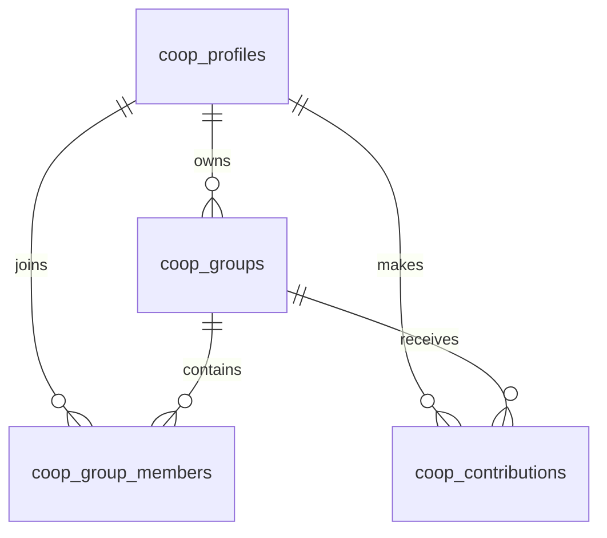
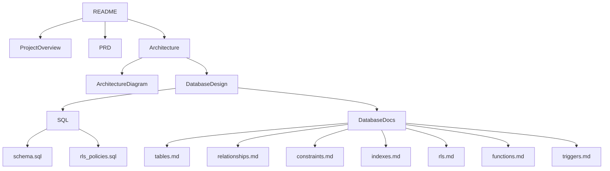

# Architecture Diagrams

**Project:** Coop Ledger  
**Version:** 1.0  
**Last Updated:** 2026-07-26

---

# 1. Purpose

This document contains the architectural diagrams that illustrate the overall structure, component interactions, data flow, authentication process, database model, and deployment architecture of the Coop Ledger application.

These diagrams complement the information provided in **Architecture.md** and **DatabaseDesign.md**.

---

# 2. System Architecture



---

# 3. Application Component Diagram



---

# 4. Authentication Flow



---

# 5. Group Membership Workflow



---

# 6. Entity Relationship Overview



---

# 7. Database Access Flow

```mermaid
flowchart LR

Browser

|

v

JavaScript Application

|

v

Supabase Client

|

v

Supabase Authentication

|

v

Row Level Security

|

v

PostgreSQL Database
```

---

# 8. Deployment Architecture

```mermaid
flowchart TD

Developer

|

v

GitHub Repository

|

v

Static Hosting

|

v

User Browser

|

v

Supabase Backend

|

|------ Authentication

|

|------ PostgreSQL Database
```

---

# 9. Documentation Relationships



---

# 10. Summary

These diagrams provide a visual representation of the Coop Ledger architecture, illustrating system structure, component interactions, authentication, database relationships, deployment, and supporting documentation. They serve as a quick reference for developers, reviewers, and future contributors.
