# Screenshots

**Project:** Coop Ledger

---

## Purpose

This document provides a visual walkthrough of the Coop Ledger MVP user interface. The screenshots illustrate the primary workflows available to members and treasurers, highlighting the application's core functionality and user experience.

---

## Application Walkthrough

| Screen | Preview |
|---------|---------|
| Login Screen | 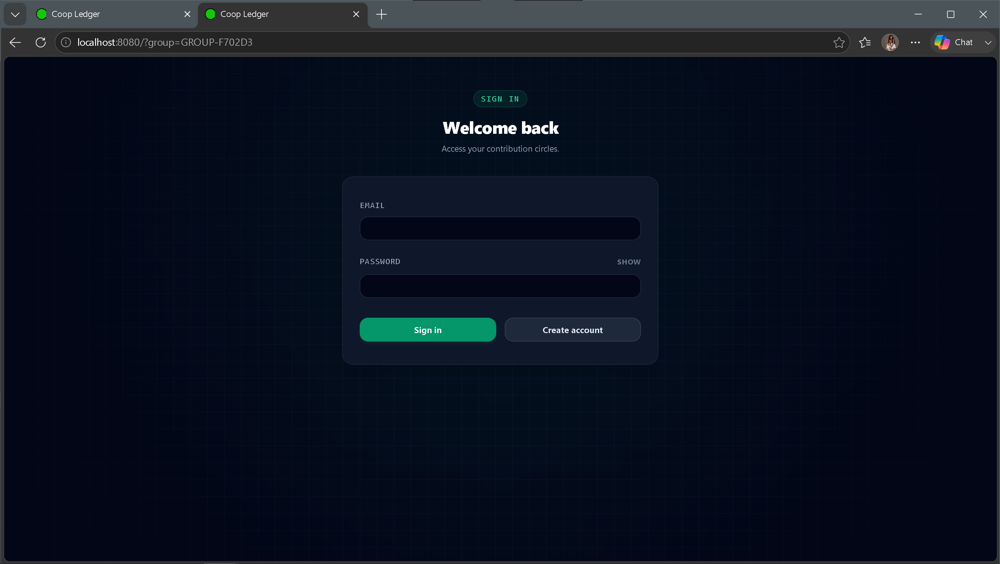 |
| Dashboard Overview | 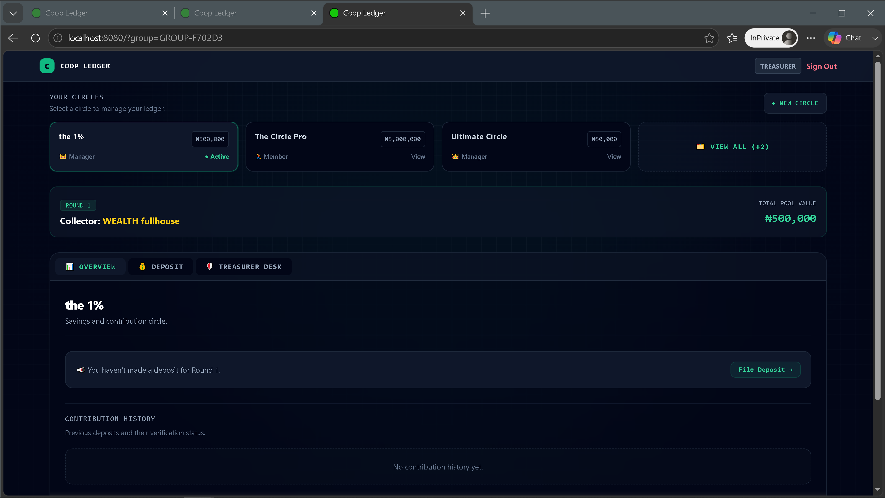 |
| Circle Hub | 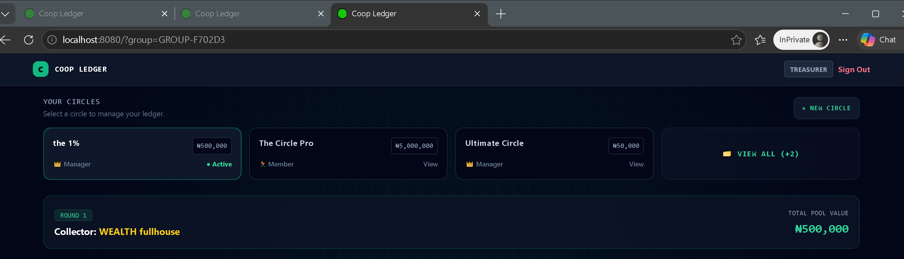 |
| Overview | 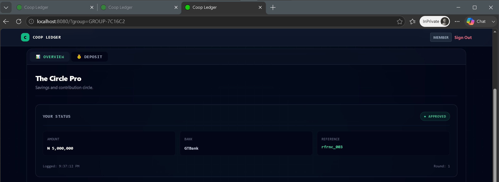 |
| Circle Creation - Step 1 | 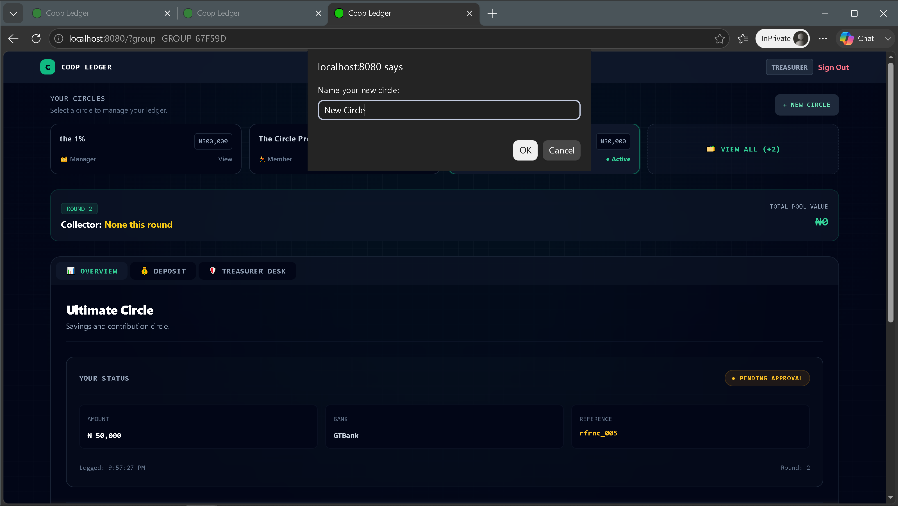 |
| Circle Creation - Step 2 | 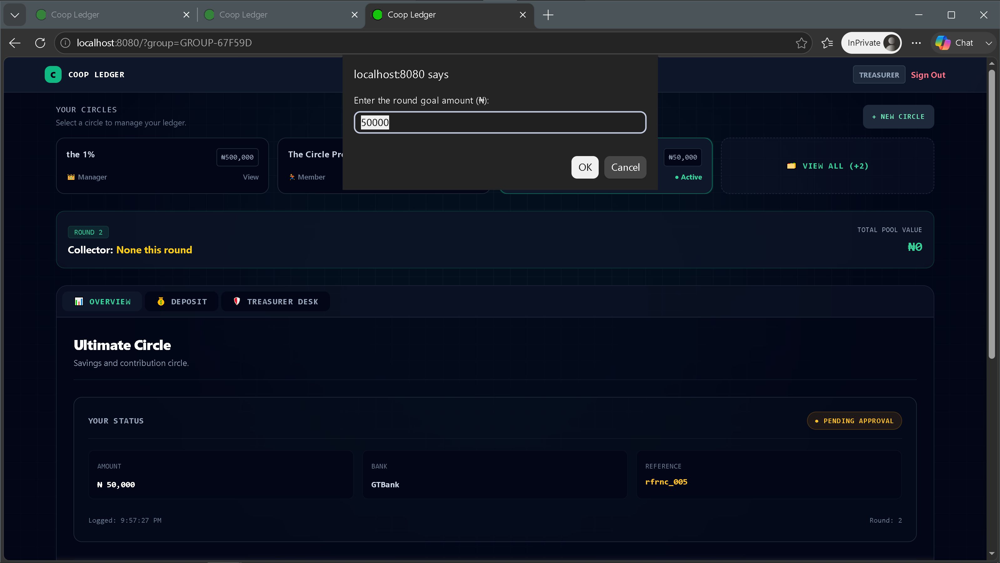 |
| Circle Creation - Step 3 | 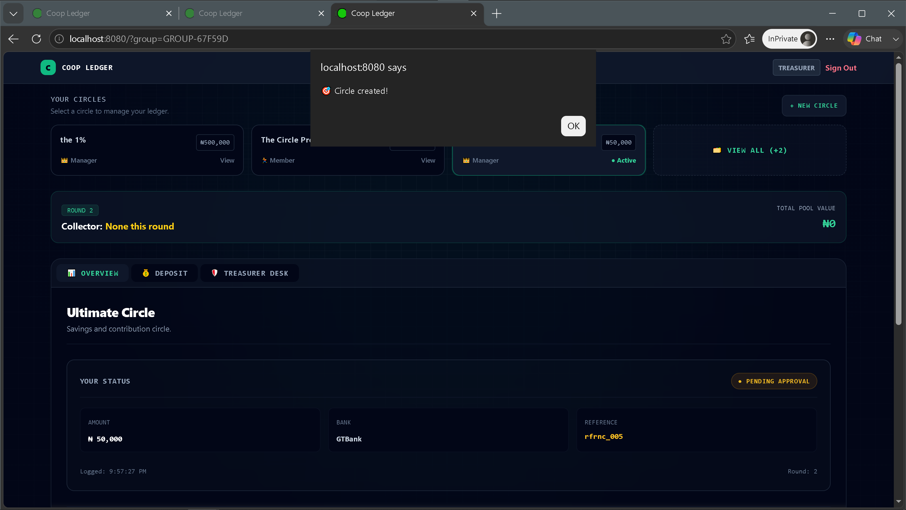 |
| Deposit Form | 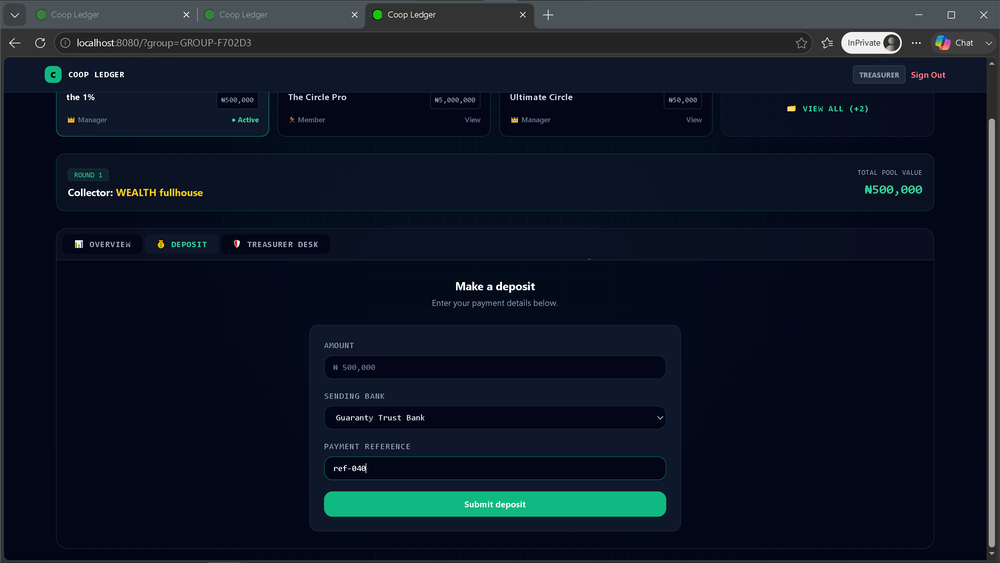 |
| Contribution History | 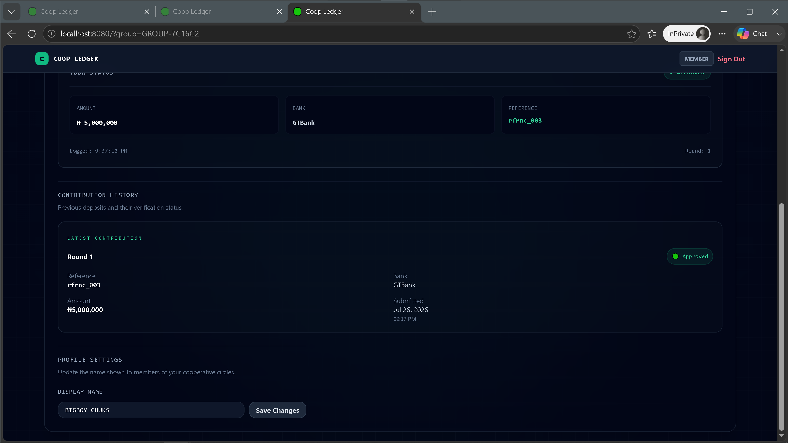 |
| Treasurer Desk | 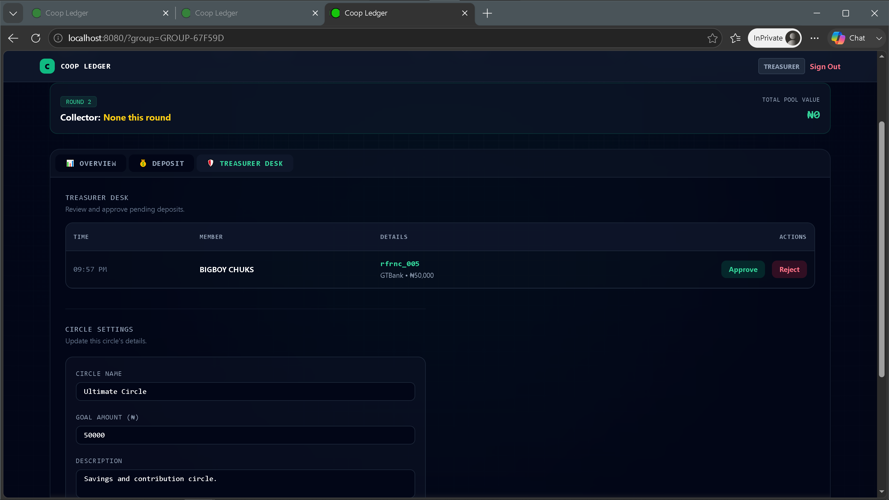 |
| Circle Settings | 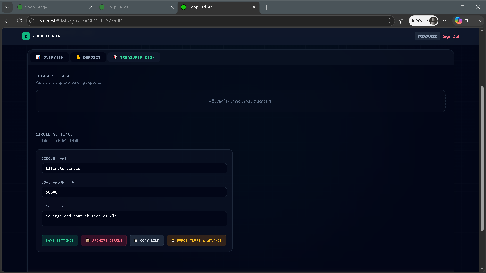 |
| Notification Engine | 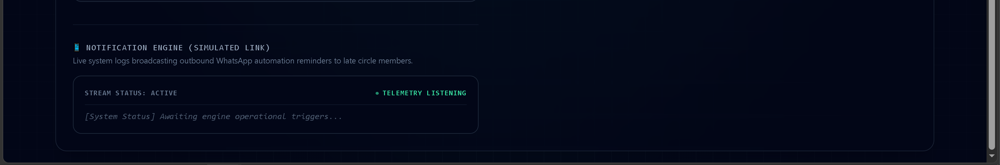 |
| Circles Drawer | 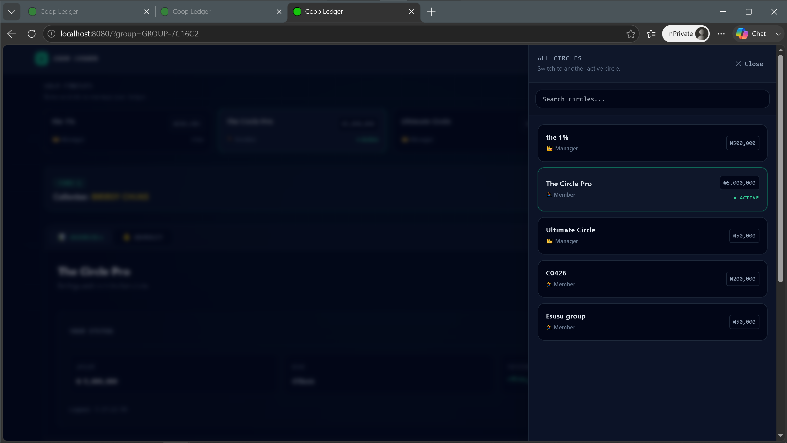 |
| Profile Settings | 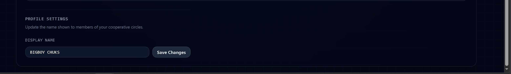 |

---

## Screenshot Descriptions

| Screenshot | Description |
|------------|-------------|
| Login Screen | User authentication interface for existing members. |
| Dashboard Overview | Main landing page displaying the currently selected cooperative circle and application overview. |
| Circle Hub | Displays all circles available to the authenticated user and allows switching between them. |
| Overview | Presents member information, contribution summaries, and cooperative statistics. |
| Circle Creation - Step 1 | Initial stage of creating a new cooperative circle. |
| Circle Creation - Step 2 | Configuration of additional circle information and settings. |
| Circle Creation - Step 3 | Final confirmation before creating the cooperative circle. |
| Deposit Form | Interface for submitting contribution payments. |
| Contribution History | Displays historical contribution records and their verification status. |
| Treasurer Desk | Administrative dashboard for reviewing and approving member contributions. |
| Circle Settings | Management interface for updating circle configuration and administrative options. |
| Notification Engine | Simulated notification and activity monitoring interface. |
| Circles Drawer | Side navigation panel for quickly switching between cooperative circles. |
| Profile Settings | Allows users to update their personal profile information. |

---

## Notes

- All screenshots were captured from the current Coop Ledger MVP build.
- Screenshots represent the application's functional state after successful workflow validation and testing.
- Personally identifiable information has been removed or replaced with demonstration data where applicable.
- Images are stored in the `assets/screenshots/` directory.
- Screenshots are intended to support the README, User Guide, and other technical documentation throughout the repository.